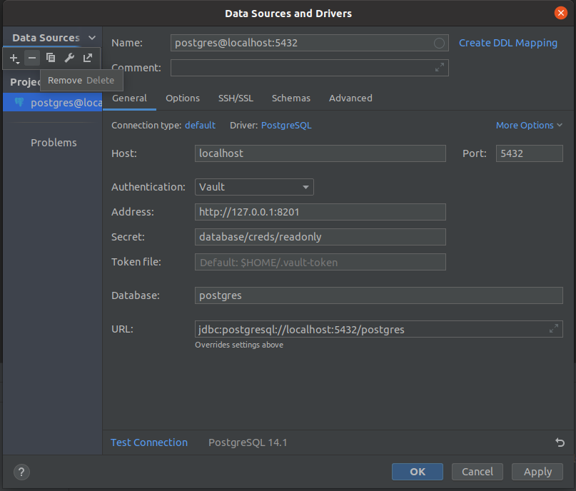

# datagrip-vault-plugin

<!-- Plugin description -->

This plugins provides database credentials using [Vault dynamic secrets](https://www.vaultproject.io/docs/secrets/databases). 

Vault login is not handled by this plugin. 

You should manually log in into Vault, which will, using the default [Token Helper](https://www.vaultproject.io/docs/commands/token-helper), create a Vault token file in $HOME/.vault-token.

The **recommended** way to use this plugin is with a [Vault Agent](https://www.vaultproject.io/docs/agent), with [Auto-Auth](https://www.vaultproject.io/docs/agent/autoauth) and [cache](https://www.vaultproject.io/docs/agent/caching) enabled.
<!-- Plugin description end -->

## Installation

- Using IDE built-in plugin system:
  
  <kbd>Settings/Preferences</kbd> > <kbd>Plugins</kbd> > <kbd>Marketplace</kbd> > <kbd>Search for "datagrip-vault-plugin"</kbd> >
  <kbd>Install Plugin</kbd>
  
- Manually:

  Download the [latest release](https://github.com/premium-minds/datagrip-vault-plugin/releases/latest) and install it manually using
  <kbd>Settings/Preferences</kbd> > <kbd>Plugins</kbd> > <kbd>⚙️</kbd> > <kbd>Install plugin from disk...</kbd>

## Screenshots

